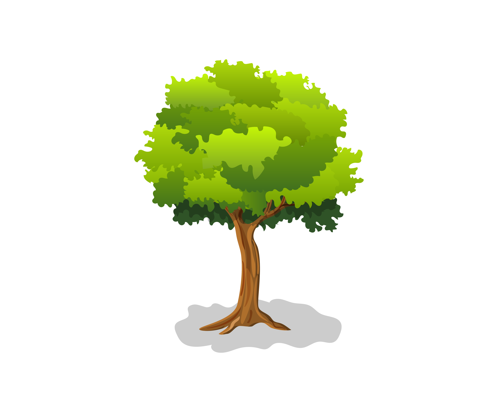

<style>
.forceBreak { -webkit-column-break-after: always; break-after: column; }
</style>


```{r setup, include=FALSE}
knitr::opts_chunk$set(echo = FALSE)
```

```{css, echo=FALSE}
pre {
  max-height: 700px;
  overflow-y: auto;
}

pre[class] {
  max-height: 500px;
}

.scroll-100 {
  max-height: 500px;
  overflow-y: auto;
  background-color: inherit;
}
```

# Piante

## Slide with R Output

```{r cars, echo = TRUE}
summary(cars)
```

## Slide with Plot

```{r pressure}
plot(pressure)
```

## Slide with pic

```{r, fig.cap = "germoglio", fig.align="center", out.width="50%"}
knitr::include_graphics(path = "immagini/germ.jpeg")
```   



## Slide with testo molto piccolo

<font size="1"> testo molto piccolo </font>

## Slide con due colonne {.columns-2 .build} 

<div style="float: left; width: 50%; text-align: right;">

Germogliamento

Si tratta del momento di schiusura delle gemme.

Questa fase inizia 2 o 3 giorni dopo l’inizio del pianto, quindi tra fine marzo (nelle zone più a sud) e i primi di aprile (al centro e al nord).

Affinchè inizi ci devono essere alcune condizioni tra cui una temperatura intorno ai 7-12°C.

La crescita dei germogli è massima durante la fioritura.

</div> 


<p class="forceBreak"></p>

<span style="color:blue">
<div style="float: right; width: 50%; text-align: right;">

Seconda colonna

```{r, fig.cap = "germoglio", fig.align="center", out.width="50%"}
knitr::include_graphics(path = "immagini/germ.jpeg")
```   
 
</div>
</span>

## Slide con codice


```{r, eval=FALSE, class.output="scroll-100", echo=TRUE}
shiny::shinyApp(
 ui = fluidPage(
  sidebarLayout(
    sidebarPanel(
      selectInput(inputId = "dataset", # nome dell'input per il server
                  label = "Choose a dataset:", # nome dell'input per lo user
                  choices = c("rock", "pressure")) # opzioni
    ),

    mainPanel(
      plotOutput( #qui voglio un grafico 
        "graph"   
      )
    ) 
  )
),

server = function(input, output){
  output$graph <- renderPlot({
    if(input$dataset == "rock"){ 
      data <- rock
    } else {
      data <- pressure
    } 
    plot(data[, c(1:2)])
  })
}, 
options = list(height = 300)
)
```


