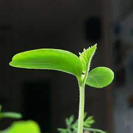

```{r setup, include=FALSE}
knitr::opts_chunk$set(echo = TRUE)
 #data("PlantGrowth")
 #dati = PlantGrowth
 load ("dati_plants.RData")
  hook_output <- knitr::knit_hooks$get("output")
 
 knitr::knit_hooks$set(output = function(x, options) {
     if (!is.null(n <- options$out.lines)) {
         x <- xfun::split_lines(x)
         if (length(x) > n) {
             # truncate the output
             x <- c(head(x, n), "....\n")
         }
         x <- paste(x, collapse = "\n")
     }
     hook_output(x, options)
 })
```

```{r plants, echo=FALSE, eval = TRUE}
(head(dati))

```

```{r, comment="NA", eval = TRUE}
summary(dati)

```

```{r, eval= FALSE, results="hide"}

```

```{r, echo = FALSE, eval = TRUE}
# rinominare la variabaile dipendente in y
dati$y = PlantGrowth$weight
# rinominare la variabile indipedente in x
dati$x = PlantGrowth$group
plot(dati$y ~ dati$x)
```

```{r, echo = TRUE, eval = FALSE, results="hide"}
plot(dati$y ~ dati$x)
```

```{r, comment=" ", out.lines=10}
PlantGrowth
```

```{r, fig.cap = "fasi di crescita di una piantina", fig.align="center", out.width="50%"}
knitr::include_graphics(path = "immagini/piante.jpg")

```

# Introduzione

[\color{red}{Kyūjitai}\normalcolor](https://it.wikipedia.org/wiki/Ky%C5%ABjitai)

**Le piante** hanno una vita molto simile alla nostra. Anche loro passano attraverso diverse fasi di crescita, a partire dalla germinazione fino alla senescenza. A differenza nostra, però, le piante presentano una vita ciclica che si ripete di stagione in stagione.

# Pianto

In questa fase così affascinante da osservare, si riattiva il **metabolismo** della pianta e la respirazione cellulare. La linfa vitale sale dalle radici fino alle foglie, passando dai tralci. Dai tagli effettuati durante la potatura escono piccole gocce di linfa simili a lacrime (da cui il nome pianto della vite) in quantità che va ***da pochi decilitri a qualche litro per pianta.***

> Questo processo dura 15-20 giorni e avviene tra la fine di marzo e i primi di aprile.

# Germogliamento

Si tratta del momento di schiusura delle gemme.

Questa fase inizia 2 o 3 giorni dopo l’inizio del pianto, quindi tra fine marzo (nelle zone più a sud) e i primi di aprile (al centro e al nord).

Affinchè inizi ci devono essere alcune condizioni tra cui una temperatura intorno ai \color{red}{7-12°C.} \normalcolor

La crescita dei germogli è massima durante la fioritura.



# Fioritura

**La formazione dei fiori** avviene fra la fine di aprile e l’inizio di giugno, a seconda della latitudine.\color{green}{Lorem ipsum} \normalcolor I fiori della vite sono poco appariscenti ed hanno la forma di una piccola pannocchia verde. Sono ermafroditi e l’impollinazione è anemofila, ossia avviene grazie al trasporto del polline da parte del vento, non necessita degli insetti.

Dai fiori fecondati (che sonodal 30 al 60% dei fiori totali, in base al vitigno) si sviluppano quelli che saranno acini, i fiori non fecondati invece muoiono e cadono.

dolor sit amet, consectetur adipiscing elit. Cras mauris turpis, convallis quis mauris vel, volutpat dapibus sapien. Ut convallis, nisi id scelerisque tristique, tortor massa tincidunt purus, ut pellentesque turpis mi eu velit. Ut ac lectus at ligula pellentesque egestas id eu urna. In eu tristique mauris. Ut ut lacus velit. Nullam eget molestie urna, eget tempor odio. Duis et ante et lorem porttitor molestie. In dui diam, iaculis sed erat non, suscipit imperdiet risus. Proin bibendum viverra gravida. Nulla venenatis risus in felis rhoncus pretium in quis odio. Suspendisse potenti. Sed condimentum interdum metus, sit amet vestibulum mauris vestibulum at. Morbi non orci at augue dapibus tristique non eget ipsum. Morbi elementum nunc non odio elementum elementum. [@epifania2020dscoreapp]

\color{blue}{Vivamus eleifend sollicitudin libero vitae maximus}\normalcolor. In lobortis justo non commodo auctor. Integer suscipit ipsum non ipsum rhoncus, quis posuere velit interdum. Praesent nec dictum libero, vel imperdiet arcu. Aenean vel gravida sem. Fusce dictum lectus a mollis vehicula. Aenean vel euismod libero, vel suscipit enim. Aenean et nulla finibus, egestas dolor quis, vestibulum arcu. Suspendisse facilisis enim quis eros ullamcorper mollis. Donec porttitor vulputate mi, id finibus urna fermentum quis. Nam tincidunt sem eu tempor consectetur. Suspendisse in luctus erat. Morbi suscipit pulvinar malesuada. Ut bibendum turpis sed ultrices sagittis. Vestibulum quam tortor, egestas at mollis ac, tempor id velit. Morbi vitae elementum quam[^1]. [@epifania2021implicit]

[^1]: lorem

-   guerra
    -   giappone
    -   lorem
-   ipsum

1.  marina[^2]
2.  militare
3.  giapponese
4.  in guerra

[^2]: militare

```{r, results='asis', echo=FALSE, message=FALSE}
library(stargazer)
stargazer(PlantGrowth, type="latex", summary = TRUE, 
title= "Tabella di summary", digits = 2, header=FALSE)

```
```{r, results='asis', echo=FALSE}
m = lm(y ~ x, data = dati)
 stargazer(m, type = "latex", summary = TRUE, title = "Risultati del modello", digits = 2,
     header = FALSE)
```

```{r, results='asis'}
 m0 = lm(y ~ x, data = dati)
 m1 = lm(y ~ x, data = dati)
 stargazer(m0, m1, type = "latex", title = "Model comparison", digits = 2, intercept.top = TRUE,
     intercept.bottom = FALSE, header = FALSE)
```

```{r}
(dati$y)
```


$$z_i = \dfrac{x_i - \bar{x} }{sd}$$
$$z_i = {((dati$y[1]) - \(mean(dati$y)))}{sd(dati$y)}}` $$

$$z_i = \dfrac{x_i - \bar{x} }{sd} = \frac{`r dati$y[1]}$$ 

#definizione ambiente matematico con i $$, poi definizione oggetto matematico da usare (qui frac), poi posso mettere il codice di r all'interno dell'oggetto matematico dentro l'ambiente matematico

\newpage

# References
